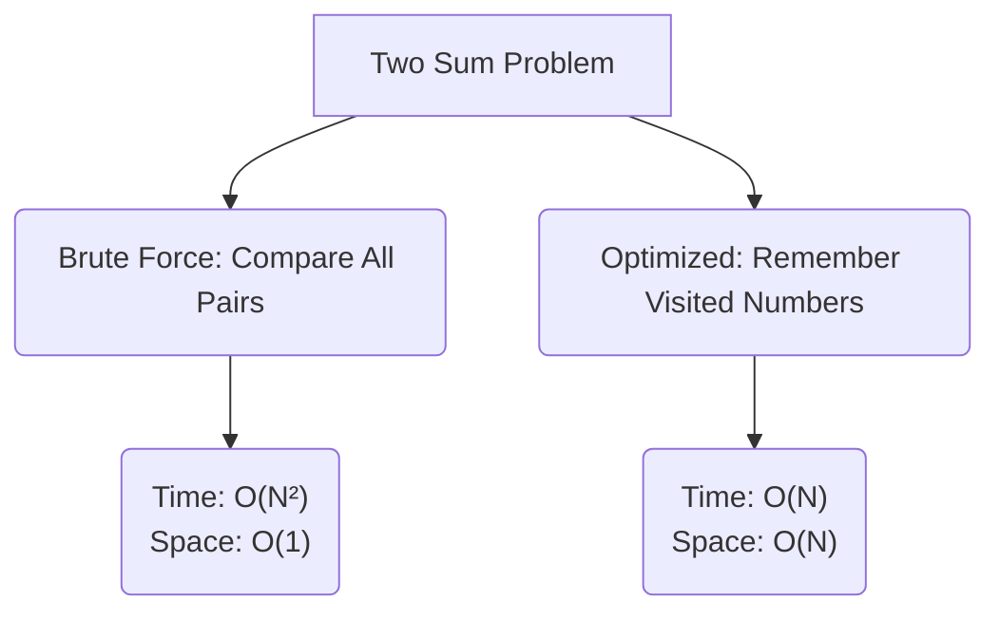

# Time and Space Complexity ⏱️📦

In technical interviews, writing working code is only **half the battle**. The other half is explaining how efficiently it runs. Interviewers use complexity analysis to evaluate your problem-solving skills, system-design awareness, and computer science fundamentals.

> **💡 The Interview Reality:** 
> *   `Working Code + Bad Complexity = Rejection`
> *   `Unfinished Code + Perfect Complexity Analysis = Often a Pass (or at least strong follow-up)`

---

## 1. Core Theory & Proper Definitions

### ⏱️ Time Complexity
Time complexity measures **how the execution time of an algorithm grows as the size of the input ($N$) increases**.


### 📦 Space Complexity vs. Auxiliary Space
Space complexity measures **how the total memory (space) required by an algorithm grows as the size of the input ($N$) increases**.

This is a classic trap where many candidates slip up.

$$\text{Total Space Complexity} = \text{Input Space} + \text{Auxiliary Space}$$

*   **Input Space:** The memory occupied by the input itself (e.g., the array passed into your function).
*   **Auxiliary Space:** The **extra or temporary memory** allocated by the algorithm to solve the problem (e.g., a new hashmap, arrays, or recursive call stack frames).

> [!IMPORTANT]
> **Interview Rule of Thumb:** When an interviewer asks, *"What is the space complexity of your solution?"*, they almost always mean **Auxiliary Space**. 
> Always clarify: *"Would you like me to include the input size in the space complexity, or should I define the auxiliary space?"* This shows maturity and attention to detail.

---

## 2. Asymptotic Notations: The Big Three

Asymptotic notation in Data Structures and Algorithms is a mathematical way to describe how the running time or memory usage of an algorithm grows as the input size n becomes very large.

We use mathematical notations to represent complexity. In interviews, you need to understand these three:

```
                  Upper Bound: Big-O O(f(n))
                 /
  Exact Growth: Theta Θ(f(n))
                 \
                  Lower Bound: Big-Omega Ω(f(n))
```

1.  **Big-O ($O$): The Upper Bound (Worst-Case)**
    *   Defines the **maximum** number of operations or memory your algorithm will ever need.
    *   *Analogy:* "This project will take at most 5 days to complete."
    *   *Interview Focus:* This is what 99% of interviewers care about because they want guarantees that your system won't crash under peak loads.

2.  **Big-Omega ($\Omega$): The Lower Bound (Best-Case)**
    *   Defines the **minimum** number of operations or memory.
    *   *Analogy:* "This project will take at least 1 hour." (Usually trivial/uninformative).

3.  **Big-Theta ($\Theta$): The Tight Bound (Average/Exact Case)**
    *   Defines the exact rate of growth when the upper and lower bounds are matching.
    *   *Analogy:* "This project will take exactly 3 days."

---

## 3. Types of Complexity

Time complexities are categorized based on how an algorithm's runtime scales with the input size.


Here is the hierarchy of growth rates, ranked from **fastest (most efficient)** to **slowest (least efficient)**.

| Notation | Name | Real-World Analogy | Python Example | Efficiency for $N=10^4$ |
| :--- | :--- | :--- | :--- | :--- |
| **$O(1)$** | Constant | Finding a word if you already have the page number. | Accessing list by index (`arr[0]`) | $1$ operation (Instant) |
| **$O(\log n)$** | Logarithmic | Finding a word in a physical dictionary by splitting it in half repeatedly. | Binary Search | $\approx 13$ operations (Blazing Fast) |
| **$O(n)$** | Linear | Reading a book page-by-page from start to finish. | Linear Search / Single Loop | $10,000$ operations (Fast) |
| **$O(n \log n)$** | Linearithmic | Sorting a messy pile of papers using Merge Sort. | Built-in `.sort()` / Timsort | $\approx 1.3 \times 10^5$ operations (Good) |
| **$O(n^2)$** | Quadratic | Comparing every single student's test score with every other student's score. | Nested Loops / Bubble Sort | $10^8$ operations (Slow - Danger Zone) |
| **$O(2^n)$** | Exponential | Trying every single combination on a combination lock. | Recursive Fibonacci | $2^{10000}$ operations (Will crash/never finish) |
| **$O(n!)$** | Factorial | Finding the shortest route to visit $N$ cities (Traveling Salesman). | Generating all permutations | $\infty$ (Utterly uncomputable for $N>20$) |

### 🚀 Visualizing Growth: The "1-Second Rule"
Most interview platforms (LeetCode, HackerRank) limit code execution to **1 second**. On modern computers, this translates to roughly **$10^8$ operations**. 

Use this cheat sheet to choose your algorithm based on the constraints:

| Input Size ($N$) | Maximum Allowed Complexity | Typical Solution Type |
| :--- | :--- | :--- |
| $N \le 10$ | $O(n!)$ or $O(2^n)$ | Backtracking, Permutations |
| $N \le 20$ | $O(2^n)$ | Dynamic Programming, State Compression |
| $N \le 500$ | $O(n^3)$ | Floyd-Warshall, Triple Nested Loops |
| $N \le 5,000$ | $O(n^2)$ | Double Nested Loops, Insertion Sort |
| $N \le 10^5$ | $O(n \log n)$ | Merge Sort, Heap, Tree Maps |
| $N \le 10^7$ | $O(n)$ | Linear Scan, Hash Map, Two Pointers |
| $N > 10^8$ | $O(\log n)$ or $O(1)$ | Binary Search, Math / Bit Manipulation |

---

## 4. Common Complexity Classes: Code Examples

Let's look at Python snippets and break down exactly why they have their respective complexities, with simple explanations and analogies.

### 🟢 Constant Time: $O(1)$
An algorithm is said to run in **constant time** if the time it takes to execute does not change, regardless of how large the input ($n$) is. 

*   **Simple Explanation:** Whether you pass a list of 5 elements, 5,000 elements, or 5 million elements, the code will take the exact same number of operations (e.g., just 1 or 2 steps) and complete almost instantly. It is the gold standard of efficiency because it doesn't scale with input size.
*   **Real-World Analogy:** Looking at who is standing at the front of a line. It doesn't matter if there are 2 people or 2,000 people in the line; you only need to look at the first person.
```python
def get_first_element(arr: list) -> int:
    # This takes 1 operation regardless of whether 'arr' has 5 elements or 5 million.
    return arr[0] if arr else -1
```
*   **Time:** $O(1)$
*   **Auxiliary Space:** $O(1)$ (No extra memory used)

---

### 🟢 Logarithmic Time: $O(\log n)$
An algorithm is said to run in **logarithmic time** when the size of the input is cut in half at every step. As the input grows, the number of steps grows very slowly.

*   **Simple Explanation:** Every time you perform an operation, you discard half of the remaining work. This makes it incredibly efficient because even if the input size multiplies by a massive amount, the number of operations increases by only a tiny, constant amount.
*   **Real-World Analogy:** Searching for a name in a physical phone book. You don't read page 1, then page 2. Instead, you open it in the middle. If the name you want is alphabetically earlier, you throw away the second half of the book and repeat the process on the first half. Even if the phone book has 1 million names, you can find the name in about 20 steps!
```python
def divide_by_two(n: int) -> int:
    steps = 0
    while n > 0:
        n = n // 2  # The input is halved each time
        steps += 1
    return steps
```
*   **Why $\log n$?:** If $N = 16$, the loop executes: $16 \to 8 \to 4 \to 2 \to 1 \to 0$ (5 steps). Notice that $2^4 = 16$. The number of steps is the power to which 2 must be raised to equal $N$, which mathematically is $\log_2(N)$.
*   **Time:** $O(\log n)$
*   **Auxiliary Space:** $O(1)$

---

### 🟡 Linear Time: $O(n)$
An algorithm runs in **linear time** when the execution time increases in direct proportion to the size of the input $n$.

*   **Simple Explanation:** If you double the size of the input, the time it takes to run will also double. If you have $n$ items, you perform a step/operation for every single item.
*   **Real-World Analogy:** Reading a book page-by-page. If the book has 10 pages, it takes 10 units of time. If the book has 100 pages, it takes 100 units of time.
```python
def find_max(arr: list) -> int:
    if not arr:
        return -1
    max_val = arr[0]
    for num in arr:  # Runs exactly N times
        if num > max_val:
            max_val = num
    return max_val
```
*   **Why $O(n)$?:** We scan the list containing $n$ elements exactly once.
*   **Time:** $O(n)$
*   **Auxiliary Space:** $O(1)$

---

### 🟡 Linearithmic Time: $O(n \log n)$
An algorithm runs in **linearithmic time** when it performs a logarithmic operation ($O(\log n)$) a linear number of times ($n$). 

*   **Simple Explanation:** Think of this as a combination of linear growth ($n$) and logarithmic growth ($\log n$). It is slightly slower than linear time but still very fast and highly practical. This is the optimal time complexity for general sorting algorithms (like Merge Sort or Quick Sort).
*   **Real-World Analogy:** Imagine you have $n$ boxes of unsorted books, and you want to sort each book inside them. To sort each box, you use a fast logarithmic search/sort method, and you have to repeat this process for all $n$ boxes.
```python
def sort_and_find_duplicates(arr: list) -> bool:
    # Python's built-in sort() is Timsort, which takes O(n log n) time.
    arr.sort() 
    
    # This loop takes O(n) time.
    for i in range(len(arr) - 1):
        if arr[i] == arr[i+1]:
            return True
    return False
```
*   **Why $O(n \log n)$?:** Total Time = $O(n \log n)$ [sorting] + $O(n)$ [loop]. Because $O(n \log n)$ grows faster than $O(n)$, we drop the smaller term, resulting in $O(n \log n)$.
*   **Time:** $O(n \log n)$
*   **Auxiliary Space:** $O(n)$ or $O(1)$ depending on the sorting implementation (Python's Timsort uses $O(n)$ auxiliary space).

---

### 🔴 Quadratic Time: $O(n^2)$
An algorithm runs in **quadratic time** when the execution time grows proportionally to the square of the input size ($n^2$).

*   **Simple Explanation:** If the input size is 10, the program does $10^2 = 100$ operations. If the input size is 1,000, it does $1,000^2 = 1,000,000$ (1 million) operations! This type of complexity starts to become very slow for larger inputs and should be optimized if possible in interviews.
*   **Real-World Analogy:** Imagine a classroom of $n$ students, and every student needs to shake hands with every other student in the room. If there are 10 students, that's a lot of handshakes; if there are 1,000 students, the number of handshakes becomes enormous.
```python
def print_pairs(arr: list) -> None:
    n = len(arr)
    for i in range(n):        # Outer loop runs N times
        for j in range(n):    # Inner loop runs N times for every outer loop
            print(arr[i], arr[j])
```
*   **Why $O(n^2)$?:** Total iterations = $n \times n = n^2$.
*   **Time:** $O(n^2)$
*   **Auxiliary Space:** $O(1)$

---

### 💀 Exponential Time: $O(2^n)$
An algorithm is said to run in exponential time if its number of operations doubles whenever the input size increases by 1.

*   **Simple Explanation:** If you add just 1 more item to your input, the time taken to run the code doubles. If you have an input of size 10, it takes $2^{10} = 1024$ steps. If the input size is just 30, it takes $2^{30} \approx 1.07$ billion operations! This complexity is extremely slow and will cause the program to freeze or crash for inputs larger than 30 or 40.
*   **Real-World Analogy:** A classic example is a password brute-forcer trying to crack a PIN. If the PIN is 1 digit, it takes 10 tries. If it's 2 digits, it takes $10^2 = 100$ tries. With binary decisions (yes/no options), every new decision splits into two paths, causing the workload to double instantly.
```python
def recursive_fibonacci(n: int) -> int:
    if n <= 1:
        return n
    # Every call branches into two new calls
    return recursive_fibonacci(n - 1) + recursive_fibonacci(n - 2)
```
*   **Why $O(2^n)$?:** Let's visualize the recursion tree for $N=4$:
```
                    fib(4)
                   /      \
               fib(3)      fib(2)
              /     \     /      \
          fib(2)  fib(1) fib(1)  fib(0)
          /    \
      fib(1)  fib(0)
```
At each level, the number of operations roughly doubles: $1 \to 2 \to 4 \to 8 \dots \to 2^n$.
*   **Time:** $O(2^n)$
*   **Auxiliary Space:** $O(n)$ (Due to the maximum depth of the call stack, which is $n$).

---

## 5. Math Rules for Calculating Complexity

To analyze code quickly during an interview, use these four rules:

### Rule 1: Drop the Constants
We ignore multiplier constants because we care about the shape of the growth curve, not the exact value.
*   $O(2n) \to O(n)$
*   $O(5n^2 + 100) \to O(n^2)$

### Rule 2: Drop Non-Dominant Terms
In polynomials, only the term with the highest power matters for large inputs.
*   $O(n^2 + n) \to O(n^2)$
*   $O(n^3 + n \log n + 1000) \to O(n^3)$

### Rule 3: The Rule of Sum (Sequential Code)
If you have consecutive blocks of code, **add** their complexities.
```python
# Block A: O(n)
for i in range(n):
    print(i)

# Block B: O(n^2)
for i in range(n):
    for j in range(n):
        print(i, j)
```
$$\text{Total Time} = O(n) + O(n^2) \to O(n^2)$$

### Rule 4: The Rule of Product (Nested Code)
If one block of code is nested inside another, **multiply** their complexities.
```python
# Outer loop runs A times: O(A)
for i in range(A):
    # Inner loop runs B times: O(B)
    for j in range(B):
        print(i, j)
```
$$\text{Total Time} = O(A \times B)$$

> [!WARNING]
> **Interview Pitfall:** Never assume two inputs are the same. If an algorithm takes arrays `arr1` (size $A$) and `arr2` (size $B$), a nested loop is **$O(A \times B)$**, NOT $O(N^2)$. If they are sequential, it is **$O(A + B)$**, NOT $O(N)$. Explicitly use different variables!

---

## 6. Recursion & Space Complexity Analysis

Many candidates struggle with analyzing the space complexity of recursive functions. 

### 📞 The Recursion Stack
Every time a function calls itself, Python creates a "Stack Frame" in memory containing the function's variables. This frame stays in memory until the function returns.

```
Stack Frame for fib(1)  <-- Active (Top)
Stack Frame for fib(2)
Stack Frame for fib(3)
Stack Frame for fib(4)  <-- Main Call (Bottom)
```

*   **Recursion Space Rule:** The auxiliary space complexity of a recursive algorithm is proportional to the **maximum depth of the recursion tree** (how many frames are active on the call stack at the same time).
*   Even if a recursion tree has millions of nodes (like `recursive_fibonacci`), the maximum call stack depth is only $n$, because it explores paths down to the leaves one by one and cleans up completed frames. Thus, its auxiliary space is $O(n)$.

---

## 7. Time–Space Tradeoff Case Study: "Two Sum"

In interviews, the easiest way to make a slow algorithm fast is to **trade space for time**—usually by caching values in a Hash Map (Dictionary).

### Problem: 
Find if there are two numbers in a list that add up to a `target` value.



### Approach 1: Brute Force (No Extra Space)
```python
def two_sum_brute(nums: list, target: int) -> list:
    n = len(nums)
    for i in range(n):                    # O(n)
        for j in range(i + 1, n):        # O(n)
            if nums[i] + nums[j] == target:
                return [i, j]
    return []
```
*   **Time Complexity:** $O(n^2)$ (nested loops)
*   **Auxiliary Space:** $O(1)$ (no extra variables/data structures)

### Approach 2: Hash Map (Trading Space for Time)
```python
def two_sum_optimized(nums: list, target: int) -> list:
    seen = {}  # Auxiliary Space: O(n)
    for i, num in enumerate(nums):  # Time: O(n)
        complement = target - num
        if complement in seen:      # O(1) average lookup
            return [seen[complement], i]
        seen[num] = i
    return []
```
*   **Time Complexity:** $O(n)$ (we traverse the array once, hash map lookups are $O(1)$).
*   **Auxiliary Space:** $O(n)$ (in the worst case, we store almost all numbers in the `seen` hashmap).

> [!TIP]
> **How to present this tradeoff:** 
> *"The brute-force solution is space-efficient at $O(1)$ but slow at $O(n^2)$. By trading memory and allocating a hashmap to store visited values, we reduce the time complexity down to a linear $O(n)$, which is a massive performance win for large datasets."*

---

## 8. Cheat Sheet: Common Data Structures

Always remember the time complexities of standard operations. Interviewers will expect you to know these instantly.

| Data Structure | Access | Search | Insertion | Deletion | Notes |
| :--- | :--- | :--- | :--- | :--- | :--- |
| **Array / List** | $O(1)$ | $O(n)$ | $O(n)$ | $O(n)$ | Inserting/Deleting at the end is $O(1)$ amortized, but inserting at index 0 requires shifting elements. |
| **Linked List** | $O(n)$ | $O(n)$ | $O(1)$ | $O(1)$ | Insertion/Deletion is $O(1)$ *if* you already have a pointer/reference to the node. |
| **Hash Map / Dict** | N/A | $O(1)$ | $O(1)$ | $O(1)$ | $O(1)$ average case. Worst case can be $O(n)$ during hash collisions (rare). |
| **Stack** | $O(n)$ | $O(n)$ | $O(1)$ | $O(1)$ | LIFO (Last In First Out). Only top element is directly accessible. |
| **Queue** | $O(n)$ | $O(n)$ | $O(1)$ | $O(1)$ | FIFO (First In First Out). |
| **Binary Search Tree** | $O(\log n)$ | $O(\log n)$ | $O(\log n)$ | $O(\log n)$ | **Warning:** Worst case is $O(n)$ if the tree is unbalanced (skewed like a linked list). |
| **AVL / Red-Black Tree**| $O(\log n)$ | $O(\log n)$ | $O(\log n)$ | $O(\log n)$ | Self-balancing, guaranteeing logarithmic performance. |

---