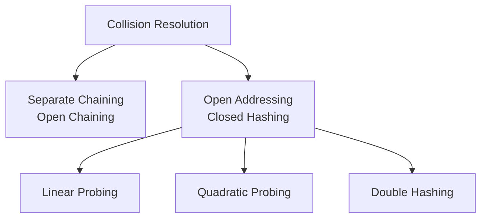

## 1️⃣ What is Hashing?

Hashing is a technique used in computer science to store and retrieve data extremely fast. It maps data (like a string or a number) to a specific index in a hash table (an array) using a special mathematical formula called a **Hash Function**.

- **Key Takeaway**: Hashing allows us to search, insert, and delete data in constant time, i.e., **$O(1)$** on average.
- **Goal**: Instead of searching through every element of an array (which takes $O(N)$ time), hashing calculates the exact index where the data is stored, so we can jump directly to it.

### Mathematical Representation
If $K$ is the input key and $h$ is the hash function, the index $i$ in a hash table of size $m$ is calculated as:

$$i = h(k) \% m$$

Where:
- $k$ is the input key (e.g., `"apple"` or `105`).
- $h(k)$ is the hash value generated from the key.
- $m$ is the total size of the hash table.
- $i$ is the final index where the data will be stored.


---

## 2️⃣ Why Do We Use Hashing?

In interviews, you must justify data structure choices based on performance and trade-offs. We use hashing because traditional data structures fall short when scaling to large datasets.

### The Problem with Alternative Data Structures

* **Arrays / Linked Lists (Sequential search)**:
  - **Searching** requires checking elements one by one.
  - Time complexity: **$O(N)$** (Linear time - slow for large datasets).

* **Sorted Arrays**:
  - **Searching** is fast using Binary Search: **$O(\log N)$**.
  - **Insertion/Deletion** is slow: **$O(N)$** because we have to shift elements to maintain sorted order.

* **Balanced Binary Search Trees (e.g., AVL, Red-Black Trees)**:
  - Search, Insert, and Delete all take **$O(\log N)$** time.
  - While $O(\log N)$ is good, hashing is even faster, offering **$O(1)$** average time.

---

## 3️⃣ Hash Table Data Structure Overview

A Hash Table is an array-based data structure that stores key-value pairs. There are two main ways hash tables are exposed in modern programming languages:

1. **Hash Set**: A collection of unique keys (only stores keys, no duplicates).
   - *JavaScript*: `Set`
   - *Python*: `set`
   - *Java*: `HashSet`
   - *C++*: `unordered_set`

2. **Hash Map / Dictionary**: A collection of key-value pairs.
   - *JavaScript*: `Map` or standard Object `{}`
   - *Python*: `dict`
   - *Java*: `HashMap`
   - *C++*: `unordered_map`

### Real-World Applications:
- **Databases**: Fast indexing of records.
- **Cryptography**: Storing hashed passwords (like SHA-256) so they aren't saved in plain text.
- **Caches**: Web browsers cache page content using URLs as keys.
- **Compilers**: Storing variable and function names in a Symbol Table.

---

## 4️⃣ How Does Hashing Work?

Let's understand this with a simple step-by-step example. Suppose we want to store the keys: `["ab", "cd", "efg"]` in a hash table of size **7**.

- **Step 1: Define a Hash Function**
  Let's sum the alphabetical position of each letter:
  `'a' = 1, 'b' = 2, 'c' = 3, 'd' = 4, 'e' = 5, 'f' = 6, 'g' = 7`...

- **Step 2: Calculate the Key Sums**
  - `"ab"` = $1 + 2 = 3$
  - `"cd"` = $3 + 4 = 7$
  - `"efg"` = $5 + 6 + 7 = 18$

- **Step 3: Map to Hash Table Indices (using Modulo size 7)**
  - `"ab"` $\rightarrow 3 \% 7 = \mathbf{3}$ (Store at index 3)
  - `"cd"` $\rightarrow 7 \% 7 = \mathbf{0}$ (Store at index 0)
  - `"efg"` $\rightarrow 18 \% 7 = \mathbf{4}$ (Store at index 4)


Now, if we want to search for `"efg"`, we don't look at index 0 or 3. We calculate `18 % 7 = 4`, jump straight to index 4, and find `"efg"`. This is **$O(1)$** search!

---

## 5️⃣ What is a Hash Function?

A **Hash Function** is a function that takes any input (keys of arbitrary size) and converts it into a fixed-size integer index.

### Characteristics of a Good Hash Function:
1. **Determinism**: The same key must always produce the same index.
2. **Fast Computation**: Calculating the index must be fast ($O(1)$).
3. **Uniform Distribution**: Keys should be spread evenly across the table.
4. **Minimizes Collisions**: It should avoid mapping different keys to the same index.

---

## 6️⃣ What is Collision?

A **Collision** occurs when two different keys generate the exact same index.

### Example:
Suppose our hash function is $h(k) = k \% 10$.
- Key = $25 \rightarrow 25 \% 10 = \mathbf{5}$
- Key = $35 \rightarrow 35 \% 10 = \mathbf{5}$

Both keys want to be stored at index **5**. Since a slot in an array can hold only one value directly, we have a collision.
Collisions are mathematically **unavoidable** when the number of possible keys is larger than the size of the hash table (a concept known as the *Pigeonhole Principle*).

---

## 7️⃣ How Do We Handle Collision?

There are two primary strategies for resolving collisions:



### 1. Separate Chaining (Open Chaining)
Instead of storing elements directly in the table slots, each index of the hash table points to a **Linked List** (or array/bucket). When a collision occurs, we simply append the new element to the linked list at that index.

#### Example:
If keys `25`, `35`, and `45` all hash to index `5`:
```text
Index 5 -> [25, "Value1"] -> [35, "Value2"] -> [45, "Value3"]
```

#### Advantages:
- Extremely simple to implement.
- The hash table never fills up completely; you can keep adding elements.
- Less sensitive to a poor hash function.

#### Disadvantages:
- Extra memory is required to store pointers/links.
- Cache performance is poor because linked list nodes are scattered in memory.
- If all keys collide at the same index, search performance degrades to **$O(N)$**.

---

## 8️⃣ Open Addressing (Closed Hashing)

In Open Addressing, all elements are stored directly inside the hash table itself. No external linked lists are allowed. If a collision occurs at an index, we "probe" (search) for another empty slot in the table according to a specific pattern.

### 1. Linear Probing
We search for the next available slot sequentially (index by index: $+1, +2, +3...$).

- **Formula**:
  $$h(k, i) = (h(k) + i) \% m$$
  Where $i$ is the probe attempt number ($0, 1, 2...$).

- **Example**:
  Suppose table size = 10, and key `25` is at index `5`.
  When inserting key `35`, it collides at index `5`.
  We probe $i=1$: $(5 + 1) \% 10 = 6$.
  If index `6` is empty, we store `35` at index `6`.

- **Drawback (Primary Clustering)**:
  Linear probing leads to blocks of consecutive filled slots. Once a cluster forms, collisions become more frequent, causing search times to increase.

---

### 2. Quadratic Probing
Instead of checking consecutive slots, we search for empty slots using quadratic jumps ($+1^2, +2^2, +3^2...$).

- **Formula**:
  $$h(k, i) = (h(k) + i^2) \% m$$

- **Example**:
  If index `5` is occupied:
  - Check $5 + 1^2 = 6$
  - Check $5 + 2^2 = 9$
  - Check $5 + 3^2 = 14 \% 10 = 4$

- **Advantage**: Reduces primary clustering.
- **Drawback (Secondary Clustering)**: Keys that hash to the same starting index will follow the same probe sequence.

---

### 3. Double Hashing
We use a **second hash function** ($h_2(k)$) to determine the step size for probing.

- **Formula**:
  $$h(k, i) = (h_1(k) + i \times h_2(k)) \% m$$

- **Rule**: $h_2(k)$ must never return 0, and the size of the table $m$ should be a prime number to ensure we visit all slots.
- **Advantage**: Virtually eliminates clustering. This is the best open addressing technique.

---

## 9️⃣ Load Factor & Rehashing

### What is Load Factor ($\lambda$)?
Load factor tells us how full the hash table currently is. It helps decide when we need to grow the table.

$$\text{Load Factor } (\lambda) = \frac{n}{m}$$

Where:
- $n$ is the number of elements in the hash table.
- $m$ is the size of the hash table.

- **Chaining**: We usually trigger resizing when $\lambda > 0.7$ or $0.75$.
- **Open Addressing**: Resizing is triggered when $\lambda > 0.5$, because search performance drops rapidly as slots fill up.

### What is Rehashing?
When the load factor exceeds a threshold, we perform **Rehashing**:
1. Create a new hash table that is **double** the size of the current table.
2. Define a new hash function (since the table size $m$ has changed).
3. **Re-insert** all existing items from the old table into the new table.

> [!IMPORTANT]
> Rehashing is an **$O(N)$** operation because we must re-calculate the index for every single key. However, since it happens infrequently, the **amortized** cost of insert remains **$O(1)$**.

---

## 🔟 Time & Space Complexity

| Operation | Average Case | Worst Case | Reason for Worst Case |
| :--- | :--- | :--- | :--- |
| **Search** | $O(1)$ | $O(N)$ | All keys collide and end up in a single chain or probe line. |
| **Insertion** | $O(1)$ | $O(N)$ | All keys collide, requiring traversal of the entire chain or table. |
| **Deletion** | $O(1)$ | $O(N)$ | Finding the element takes $O(N)$ when all elements collide. |
| **Space** | $O(N)$ | $O(N)$ | We store $N$ elements in the table. |

---

## 1️⃣1️⃣ Applications of Hashing

- **Frequency Counting**: Counting occurrences of characters/words in a text (e.g., finding the first non-repeating character).
- **Two Sum Problem**: Using a hash map to find a pair of numbers that add up to a target in $O(N)$ instead of $O(N^2)$.
- **Subarray Sum problems**: Finding if a subarray exists with a sum equal to 0 or $K$.
- **Caching**: Storing computationally expensive results so they can be retrieved instantly.
- **Duplicate Detection**: Instantly checking if an item has already been processed.

---

## 1️⃣2️⃣ Advantages & Disadvantages

### Advantages:
1. **Near-Instant Operations**: Search, insert, and delete are extremely fast ($O(1)$ average).
2. **Direct Mapping**: Keys map directly to memory indices, avoiding search traversals.
3. **Flexibility**: Can store keys of any type (strings, integers, custom objects).

### Disadvantages:
1. **No Ordering**: Elements are stored in random order. We cannot easily find the minimum, maximum, or sort the elements.
2. **Memory Waste**: Open addressing tables require empty slots to function efficiently.
3. **Worst-case Performance**: Bad hash functions or high load factors cause collisions, degrading performance to $O(N)$.

---

## 1️⃣3️⃣ Hashing Implementation in JavaScript

Here is how you can implement Hash Tables using the two primary collision resolution techniques:

### 1. Hash Table with Separate Chaining

```javascript
class HashTableChaining {
    constructor(size = 10) {
        this.table = new Array(size).fill(null).map(() => []);
        this.size = size;
    }

    // Simple Hash Function
    _hash(key) {
        let hashValue = 0;
        for (let i = 0; i < key.length; i++) {
            hashValue += key.charCodeAt(i);
        }
        return hashValue % this.size;
    }

    // Insert or update key-value pair
    set(key, value) {
        const index = this._hash(key);
        const bucket = this.table[index];

        // If key already exists in bucket, update the value
        for (let pair of bucket) {
            if (pair[0] === key) {
                pair[1] = value;
                return;
            }
        }

        // Otherwise, insert new pair
        bucket.push([key, value]);
    }

    // Retrieve value by key
    get(key) {
        const index = this._hash(key);
        const bucket = this.table[index];

        for (let pair of bucket) {
            if (pair[0] === key) {
                return pair[1]; // Found
            }
        }
        return undefined; // Not found
    }

    // Delete key-value pair
    delete(key) {
        const index = this._hash(key);
        const bucket = this.table[index];

        for (let i = 0; i < bucket.length; i++) {
            if (bucket[i][0] === key) {
                bucket.splice(i, 1); // Remove pair
                return true;
            }
        }
        return false; // Key didn't exist
    }

    // Display table contents
    display() {
        this.table.forEach((bucket, index) => {
            if (bucket.length > 0) {
                console.log(`Index ${index}:`, bucket.map(p => `[${p[0]}: ${p[1]}]`).join(" -> "));
            }
        });
    }
}

// Verification Chaining
console.log("--- Testing Separate Chaining ---");
const mapChain = new HashTableChaining(5);
mapChain.set("name", "Vinod");
mapChain.set("mane", "Chandra"); // Collision with "name" because anagrams have same charCodeSum
mapChain.set("age", 25);

mapChain.display();
console.log("Get 'name':", mapChain.get("name"));
console.log("Get 'mane':", mapChain.get("mane"));
mapChain.delete("name");
mapChain.display();
```

---

### 2. Hash Table with Linear Probing & Rehashing (Open Addressing)

```javascript
class HashTableLinearProbing {
    constructor(size = 5) {
        this.table = new Array(size).fill(null);
        this.size = size;
        this.count = 0; // Tracks number of elements
    }

    _hash(key) {
        let hashValue = 0;
        for (let i = 0; i < key.length; i++) {
            hashValue += key.charCodeAt(i);
        }
        return hashValue % this.size;
    }

    // Insert or update key-value pair with Linear Probing
    set(key, value) {
        // Resize if load factor >= 0.7
        if (this.count / this.size >= 0.7) {
            this._resize(this.size * 2);
        }

        let index = this._hash(key);
        let i = 0;

        while (i < this.size) {
            let probeIndex = (index + i) % this.size;
            let current = this.table[probeIndex];

            // If empty slot or slot marked deleted, insert here
            if (current === null || current.isDeleted) {
                this.table[probeIndex] = { key, value, isDeleted: false };
                this.count++;
                return;
            }

            // If key already exists, update value
            if (current.key === key && !current.isDeleted) {
                current.value = value;
                return;
            }

            i++; // Move to next slot
        }

        throw new Error("Hash Table is full!");
    }

    // Retrieve value by key
    get(key) {
        let index = this._hash(key);
        let i = 0;

        while (i < this.size) {
            let probeIndex = (index + i) % this.size;
            let current = this.table[probeIndex];

            if (current === null) {
                return undefined; // Hit empty slot, key doesn't exist
            }

            if (current.key === key && !current.isDeleted) {
                return current.value;
            }

            i++;
        }
        return undefined;
    }

    // Delete value (using Soft Delete / Tombstone marking)
    delete(key) {
        let index = this._hash(key);
        let i = 0;

        while (i < this.size) {
            let probeIndex = (index + i) % this.size;
            let current = this.table[probeIndex];

            if (current === null) {
                return false; // Key not found
            }

            if (current.key === key && !current.isDeleted) {
                current.isDeleted = true; // Mark as deleted (tombstone)
                this.count--;
                return true;
            }

            i++;
        }
        return false;
    }

    // Dynamic Rehashing
    _resize(newSize) {
        console.log(`--- Resizing table from ${this.size} to ${newSize} ---`);
        const oldTable = this.table;
        
        this.size = newSize;
        this.table = new Array(newSize).fill(null);
        this.count = 0;

        for (let entry of oldTable) {
            if (entry !== null && !entry.isDeleted) {
                this.set(entry.key, entry.value);
            }
        }
    }

    display() {
        console.log(this.table.map((item, idx) => {
            if (item === null) return `[${idx}]: Empty`;
            if (item.isDeleted) return `[${idx}]: Deleted (Tombstone)`;
            return `[${idx}]: ${item.key} -> ${item.value}`;
        }).join("\n"));
    }
}

// Verification Open Addressing
console.log("\n--- Testing Linear Probing & Rehashing ---");
const mapLinear = new HashTableLinearProbing(4);
mapLinear.set("A", "Apple");
mapLinear.set("B", "Banana");
mapLinear.set("C", "Cherry"); // Trigger resizing (3/4 = 0.75 >= 0.7)

mapLinear.display();
console.log("Get 'B':", mapLinear.get("B"));
mapLinear.delete("B");
console.log("After deleting 'B':");
mapLinear.display();
console.log("Get 'C' (probe should skip deleted B):", mapLinear.get("C"));
```

---

## 1️⃣4️⃣ Important Interview Questions & Answers

### 💡 Basic Questions

#### 1. What is Hashing and how is it different from Indexing?
- **Hashing**: Converts a key into a hash value (using a mathematical hash function) which is used as an index to store the data. The relationship is determined dynamically.
- **Indexing**: A direct structural lookup mechanism (like a database index or array indices) that maps records to memory addresses directly, without necessarily computing keys dynamically.

#### 2. What is a Collision in hashing?
A collision occurs when two distinct keys yield the exact same index after passing through the hash function. Collisions are unavoidable due to the *Pigeonhole Principle* (mapping infinite keys to finite table slots).

#### 3. What is Load Factor?
Load Factor ($\lambda = n / m$) measures how full a hash table is. It helps determine when to trigger **Rehashing** (resizing the table) to maintain average $O(1)$ operations.

---

### 💡 Intermediate Questions

#### 1. Explain the differences between Separate Chaining and Open Addressing.
- **Separate Chaining**: Resolves collisions by storing conflicting elements in a linked list at each index. Needs pointer storage, but table size is fixed, and search degrades gracefully.
- **Open Addressing**: Stores all elements directly inside the table. Resolves collisions by searching (probing) for another empty slot. Requires tombstone markings during deletion and resizing at lower load factors.

#### 2. What is Clustering in Open Addressing?
- **Primary Clustering**: Occurs in Linear Probing when keys collide and search sequentially, creating large, continuous blocks of filled slots.
- **Secondary Clustering**: Occurs in Quadratic Probing when keys that hash to the same initial index follow the exact same probe sequence, creating nested clusters.

#### 3. Why do we perform Rehashing?
If a hash table becomes too full (high load factor), the probability of collisions increases dramatically. Operations slow down from $O(1)$ to $O(N)$. Rehashing doubles the table size and re-maps existing keys to restore $O(1)$ efficiency.

---

### 💡 Advanced Questions

#### 1. What is "Soft Delete" (Tombstone marking) in Open Addressing?
In Open Addressing, when you delete a key, you cannot simply clear the slot (set to `null`), because doing so would break the probe path for subsequent elements that collided and were stored further down. Instead, we mark the slot as `deleted` (Tombstone). Search operations will skip over tombstones, while insert operations can overwrite them.

#### 2. Why are Hash Table sizes preferred to be Prime Numbers?
Prime numbers help ensure that keys are distributed uniformly across the table, especially when keys exhibit mathematical patterns. If the table size is a prime number, hash value mod table size has a much lower chance of mapping to indices with common divisors, reducing collisions.

#### 3. Compare HashMap and TreeMap.
- **HashMap**: Implemented via Hashing. Search/Insert/Delete are average $O(1)$ time. Keys are unordered.
- **TreeMap**: Implemented via Self-Balancing Binary Search Trees (e.g., Red-Black Tree). Search/Insert/Delete are $O(\log N)$ time. Keys are stored in sorted order.

---

## 1️⃣5️⃣ Summary

1. **Hashing** uses a hash function to map keys to table indices, delivering **$O(1)$** average time complexity for Search, Insertion, and Deletion.
2. **Collisions** are resolved using either **Separate Chaining** (linked lists at each index) or **Open Addressing** (finding another slot in the table using Linear Probing, Quadratic Probing, or Double Hashing).
3. **Load Factor ($\lambda$)** governs performance; once it gets high, **Rehashing** increases table size and re-maps all keys to keep operations fast.
4. Always remember that while hashing is extremely fast, its worst-case is **$O(N)$** and it **does not preserve the order** of data.
