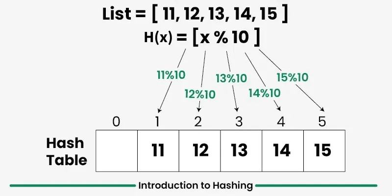
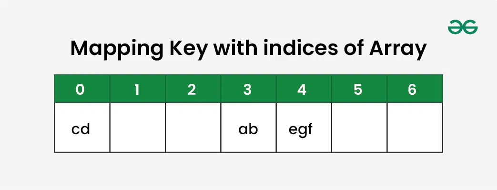
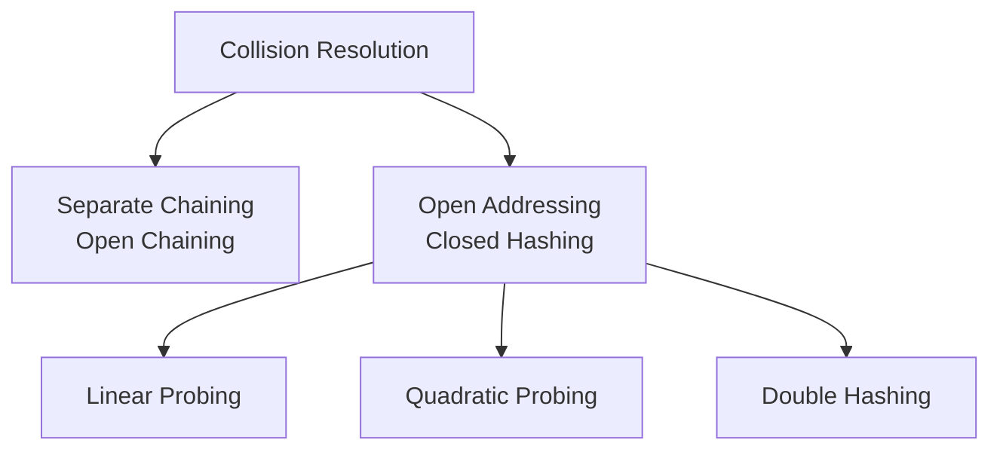

## 1️⃣ What is Hashing?

Hashing is a technique used in computer science to store and retrieve data extremely fast. It maps data (like a string or a number) to a specific index in a hash table (an array) using a special mathematical formula called a **Hash Function**.

- **Key Takeaway**: Hashing allows us to search, insert, and delete data in constant time, i.e., **$O(1)$** on average.
- **Goal**: Instead of searching through every element of an array (which takes $O(N)$ time), hashing calculates the exact index where the data is stored, so we can jump directly to it.

### Mathematical Representation

If $K$ is the input key and $h$ is the hash function, the index $i$ in a hash table of size $m$ is calculated as:

$$i = h(k) \% m$$

Where:

- $k$ is the input key (e.g., `"apple"` or `105`).
- $h(k)$ is the hash value generated from the key.
- $m$ is the total size of the hash table.
- $i$ is the final index where the data will be stored.



---

## 2️⃣ Why Do We Use Hashing?

In interviews, you must justify data structure choices based on performance and trade-offs. We use hashing because traditional data structures fall short when scaling to large datasets.

### The Problem with Alternative Data Structures

- **Arrays / Linked Lists (Sequential search)**:
  - **Searching** requires checking elements one by one.
  - Time complexity: **$O(N)$** (Linear time - slow for large datasets).

- **Sorted Arrays**:
  - **Searching** is fast using Binary Search: **$O(\log N)$**.
  - **Insertion/Deletion** is slow: **$O(N)$** because we have to shift elements to maintain sorted order.

- **Balanced Binary Search Trees (e.g., AVL, Red-Black Trees)**:
  - Search, Insert, and Delete all take **$O(\log N)$** time.
  - While $O(\log N)$ is good, hashing is even faster, offering **$O(1)$** average time.

---

## 3️⃣ Hash Table Data Structure Overview

A Hash Table is an array-based data structure that stores key-value pairs. There are two main ways hash tables are exposed in modern programming languages:

1. **Hash Set**: A collection of unique keys (only stores keys, no duplicates).
   - _JavaScript_: `Set`
   - _Python_: `set`
   - _Java_: `HashSet`
   - _C++_: `unordered_set`

2. **Hash Map / Dictionary**: A collection of key-value pairs.
   - _JavaScript_: `Map` or standard Object `{}`
   - _Python_: `dict`
   - _Java_: `HashMap`
   - _C++_: `unordered_map`

### Real-World Applications:

- **Databases**: Fast indexing of records.
- **Cryptography**: Storing hashed passwords (like SHA-256) so they aren't saved in plain text.
- **Caches**: Web browsers cache page content using URLs as keys.
- **Compilers**: Storing variable and function names in a Symbol Table.

---

## 4️⃣ How Does Hashing Work?

Let's understand this with a simple step-by-step example. Suppose we want to store the keys: `["ab", "cd", "efg"]` in a hash table of size **7**.

- **Step 1: Define a Hash Function**
  Let's sum the alphabetical position of each letter:
  `'a' = 1, 'b' = 2, 'c' = 3, 'd' = 4, 'e' = 5, 'f' = 6, 'g' = 7`...

- **Step 2: Calculate the Key Sums**
  - `"ab"` = $1 + 2 = 3$
  - `"cd"` = $3 + 4 = 7$
  - `"efg"` = $5 + 6 + 7 = 18$

- **Step 3: Map to Hash Table Indices (using Modulo size 7)**
  - `"ab"` $\rightarrow 3 \% 7 = \mathbf{3}$ (Store at index 3)
  - `"cd"` $\rightarrow 7 \% 7 = \mathbf{0}$ (Store at index 0)
  - `"efg"` $\rightarrow 18 \% 7 = \mathbf{4}$ (Store at index 4)



Now, if we want to search for `"efg"`, we don't look at index 0 or 3. We calculate `18 % 7 = 4`, jump straight to index 4, and find `"efg"`. This is **$O(1)$** search!

---

## 5️⃣ What is a Hash Function?

A **Hash Function** is a function that takes any input (keys of arbitrary size) and converts it into a fixed-size integer index.

### Characteristics of a Good Hash Function:

1. **Determinism**: The same key must always produce the same index.
2. **Fast Computation**: Calculating the index must be fast ($O(1)$).
3. **Uniform Distribution**: Keys should be spread evenly across the table.
4. **Minimizes Collisions**: It should avoid mapping different keys to the same index.

---

## 6️⃣ What is Collision?

A **Collision** occurs when two different keys generate the exact same index.

### Example:

Suppose our hash function is $h(k) = k \% 10$.

- Key = $25 \rightarrow 25 \% 10 = \mathbf{5}$
- Key = $35 \rightarrow 35 \% 10 = \mathbf{5}$

Both keys want to be stored at index **5**. Since a slot in an array can hold only one value directly, we have a collision.
Collisions are mathematically **unavoidable** when the number of possible keys is larger than the size of the hash table (a concept known as the _Pigeonhole Principle_).

---

## 7️⃣ How Do We Handle Collision?

There are two primary strategies for resolving collisions:



### 1. Separate Chaining (Open Chaining)

Instead of storing elements directly in the table slots, each index of the hash table points to a **Linked List** (or array/bucket). When a collision occurs, we simply append the new element to the linked list at that index.

#### Example:

If keys `25`, `35`, and `45` all hash to index `5`:

```text
Index 5 -> [25, "Value1"] -> [35, "Value2"] -> [45, "Value3"]
```

#### Advantages:

- Extremely simple to implement.
- The hash table never fills up completely; you can keep adding elements.
- Less sensitive to a poor hash function.

#### Disadvantages:

- Extra memory is required to store pointers/links.
- Cache performance is poor because linked list nodes are scattered in memory.
- If all keys collide at the same index, search performance degrades to **$O(N)$**.

---

## 8️⃣ Open Addressing (Closed Hashing)

In Open Addressing, all elements are stored directly inside the hash table itself. No external linked lists are allowed. If a collision occurs at an index, we "probe" (search) for another empty slot in the table according to a specific pattern.

### 1. Linear Probing

We search for the next available slot sequentially (index by index: $+1, +2, +3...$).

- **Formula**:
  $$h(k, i) = (h(k) + i) \% m$$
  Where $i$ is the probe attempt number ($0, 1, 2...$).

- **Example**:
  Suppose table size = 10, and key `25` is at index `5`.
  When inserting key `35`, it collides at index `5`.
  We probe $i=1$: $(5 + 1) \% 10 = 6$.
  If index `6` is empty, we store `35` at index `6`.

- **Drawback (Primary Clustering)**:
  Linear probing leads to blocks of consecutive filled slots. Once a cluster forms, collisions become more frequent, causing search times to increase.

---

### 2. Quadratic Probing

Instead of checking consecutive slots, we search for empty slots using quadratic jumps ($+1^2, +2^2, +3^2...$).

- **Formula**:
  $$h(k, i) = (h(k) + i^2) \% m$$

- **Example**:
  If index `5` is occupied:
  - Check $5 + 1^2 = 6$
  - Check $5 + 2^2 = 9$
  - Check $5 + 3^2 = 14 \% 10 = 4$

- **Advantage**: Reduces primary clustering.
- **Drawback (Secondary Clustering)**: Keys that hash to the same starting index will follow the same probe sequence.

---

### 3. Double Hashing

We use a **second hash function** ($h_2(k)$) to determine the step size for probing.

- **Formula**:
  $$h(k, i) = (h_1(k) + i \times h_2(k)) \% m$$

- **Rule**: $h_2(k)$ must never return 0, and the size of the table $m$ should be a prime number to ensure we visit all slots.
- **Advantage**: Virtually eliminates clustering. This is the best open addressing technique.

---

## 9️⃣ Load Factor & Rehashing

### What is Load Factor ($\lambda$)?

Load factor tells us how full the hash table currently is. It helps decide when we need to grow the table.

$$\text{Load Factor } (\lambda) = \frac{n}{m}$$

Where:

- $n$ is the number of elements in the hash table.
- $m$ is the size of the hash table.

- **Chaining**: We usually trigger resizing when $\lambda > 0.7$ or $0.75$.
- **Open Addressing**: Resizing is triggered when $\lambda > 0.5$, because search performance drops rapidly as slots fill up.

### What is Rehashing?

When the load factor exceeds a threshold, we perform **Rehashing**:

1. Create a new hash table that is **double** the size of the current table.
2. Define a new hash function (since the table size $m$ has changed).
3. **Re-insert** all existing items from the old table into the new table.

> [!IMPORTANT]
> Rehashing is an **$O(N)$** operation because we must re-calculate the index for every single key. However, since it happens infrequently, the **amortized** cost of insert remains **$O(1)$**.

---

## 🔟 Time & Space Complexity

| Operation     | Average Case | Worst Case | Reason for Worst Case                                               |
| :------------ | :----------- | :--------- | :------------------------------------------------------------------ |
| **Search**    | $O(1)$       | $O(N)$     | All keys collide and end up in a single chain or probe line.        |
| **Insertion** | $O(1)$       | $O(N)$     | All keys collide, requiring traversal of the entire chain or table. |
| **Deletion**  | $O(1)$       | $O(N)$     | Finding the element takes $O(N)$ when all elements collide.         |
| **Space**     | $O(N)$       | $O(N)$     | We store $N$ elements in the table.                                 |

---

## 1️⃣1️⃣ Applications of Hashing

- **Frequency Counting**: Counting occurrences of characters/words in a text (e.g., finding the first non-repeating character).
- **Two Sum Problem**: Using a hash map to find a pair of numbers that add up to a target in $O(N)$ instead of $O(N^2)$.
- **Subarray Sum problems**: Finding if a subarray exists with a sum equal to 0 or $K$.
- **Caching**: Storing computationally expensive results so they can be retrieved instantly.
- **Duplicate Detection**: Instantly checking if an item has already been processed.

---

## 1️⃣2️⃣ Advantages & Disadvantages

### Advantages:

1. **Near-Instant Operations**: Search, insert, and delete are extremely fast ($O(1)$ average).
2. **Direct Mapping**: Keys map directly to memory indices, avoiding search traversals.
3. **Flexibility**: Can store keys of any type (strings, integers, custom objects).

### Disadvantages:

1. **No Ordering**: Elements are stored in random order. We cannot easily find the minimum, maximum, or sort the elements.
2. **Memory Waste**: Open addressing tables require empty slots to function efficiently.
3. **Worst-case Performance**: Bad hash functions or high load factors cause collisions, degrading performance to $O(N)$.

---

## 1️⃣3️⃣ Hashing Implementation in JavaScript

Here is how you can implement Hash Tables using the two primary collision resolution techniques:

### 1. Hash Table with Separate Chaining

```javascript
class HashTableChaining {
  constructor(size = 10) {
    this.table = new Array(size).fill(null).map(() => []);
    this.size = size;
  }

  // Simple Hash Function
  _hash(key) {
    let hashValue = 0;
    for (let i = 0; i < key.length; i++) {
      hashValue += key.charCodeAt(i);
    }
    return hashValue % this.size;
  }

  // Insert or update key-value pair
  set(key, value) {
    const index = this._hash(key);
    const bucket = this.table[index];

    // If key already exists in bucket, update the value
    for (let pair of bucket) {
      if (pair[0] === key) {
        pair[1] = value;
        return;
      }
    }

    // Otherwise, insert new pair
    bucket.push([key, value]);
  }

  // Retrieve value by key
  get(key) {
    const index = this._hash(key);
    const bucket = this.table[index];

    for (let pair of bucket) {
      if (pair[0] === key) {
        return pair[1]; // Found
      }
    }
    return undefined; // Not found
  }

  // Delete key-value pair
  delete(key) {
    const index = this._hash(key);
    const bucket = this.table[index];

    for (let i = 0; i < bucket.length; i++) {
      if (bucket[i][0] === key) {
        bucket.splice(i, 1); // Remove pair
        return true;
      }
    }
    return false; // Key didn't exist
  }

  // Display table contents
  display() {
    this.table.forEach((bucket, index) => {
      if (bucket.length > 0) {
        console.log(
          `Index ${index}:`,
          bucket.map((p) => `[${p[0]}: ${p[1]}]`).join(" -> "),
        );
      }
    });
  }
}

// Verification Chaining
console.log("--- Testing Separate Chaining ---");
const mapChain = new HashTableChaining(5);
mapChain.set("name", "Vinod");
mapChain.set("mane", "Chandra"); // Collision with "name" because anagrams have same charCodeSum
mapChain.set("age", 25);

mapChain.display();
console.log("Get 'name':", mapChain.get("name"));
console.log("Get 'mane':", mapChain.get("mane"));
mapChain.delete("name");
mapChain.display();
```

---

### 2. Hash Table with Linear Probing & Rehashing (Open Addressing)

```javascript
class HashTableLinearProbing {
  constructor(size = 5) {
    this.table = new Array(size).fill(null);
    this.size = size;
    this.count = 0; // Tracks number of elements
  }

  _hash(key) {
    let hashValue = 0;
    for (let i = 0; i < key.length; i++) {
      hashValue += key.charCodeAt(i);
    }
    return hashValue % this.size;
  }

  // Insert or update key-value pair with Linear Probing
  set(key, value) {
    // Resize if load factor >= 0.7
    if (this.count / this.size >= 0.7) {
      this._resize(this.size * 2);
    }

    let index = this._hash(key);
    let i = 0;

    while (i < this.size) {
      let probeIndex = (index + i) % this.size;
      let current = this.table[probeIndex];

      // If empty slot or slot marked deleted, insert here
      if (current === null || current.isDeleted) {
        this.table[probeIndex] = { key, value, isDeleted: false };
        this.count++;
        return;
      }

      // If key already exists, update value
      if (current.key === key && !current.isDeleted) {
        current.value = value;
        return;
      }

      i++; // Move to next slot
    }

    throw new Error("Hash Table is full!");
  }

  // Retrieve value by key
  get(key) {
    let index = this._hash(key);
    let i = 0;

    while (i < this.size) {
      let probeIndex = (index + i) % this.size;
      let current = this.table[probeIndex];

      if (current === null) {
        return undefined; // Hit empty slot, key doesn't exist
      }

      if (current.key === key && !current.isDeleted) {
        return current.value;
      }

      i++;
    }
    return undefined;
  }

  // Delete value (using Soft Delete / Tombstone marking)
  delete(key) {
    let index = this._hash(key);
    let i = 0;

    while (i < this.size) {
      let probeIndex = (index + i) % this.size;
      let current = this.table[probeIndex];

      if (current === null) {
        return false; // Key not found
      }

      if (current.key === key && !current.isDeleted) {
        current.isDeleted = true; // Mark as deleted (tombstone)
        this.count--;
        return true;
      }

      i++;
    }
    return false;
  }

  // Dynamic Rehashing
  _resize(newSize) {
    console.log(`--- Resizing table from ${this.size} to ${newSize} ---`);
    const oldTable = this.table;

    this.size = newSize;
    this.table = new Array(newSize).fill(null);
    this.count = 0;

    for (let entry of oldTable) {
      if (entry !== null && !entry.isDeleted) {
        this.set(entry.key, entry.value);
      }
    }
  }

  display() {
    console.log(
      this.table
        .map((item, idx) => {
          if (item === null) return `[${idx}]: Empty`;
          if (item.isDeleted) return `[${idx}]: Deleted (Tombstone)`;
          return `[${idx}]: ${item.key} -> ${item.value}`;
        })
        .join("\n"),
    );
  }
}

// Verification Open Addressing
console.log("\n--- Testing Linear Probing & Rehashing ---");
const mapLinear = new HashTableLinearProbing(4);
mapLinear.set("A", "Apple");
mapLinear.set("B", "Banana");
mapLinear.set("C", "Cherry"); // Trigger resizing (3/4 = 0.75 >= 0.7)

mapLinear.display();
console.log("Get 'B':", mapLinear.get("B"));
mapLinear.delete("B");
console.log("After deleting 'B':");
mapLinear.display();
console.log("Get 'C' (probe should skip deleted B):", mapLinear.get("C"));
```

---

## 1️⃣4️⃣ Important Interview Questions & Answers

### 💡 Basic Questions

#### 1. What is Hashing and how is it different from Indexing?

- **Hashing**: Converts a key into a hash value (using a mathematical hash function) which is used as an index to store the data. The relationship is determined dynamically.
- **Indexing**: A direct structural lookup mechanism (like a database index or array indices) that maps records to memory addresses directly, without necessarily computing keys dynamically.

#### 2. What is a Collision in hashing?

A collision occurs when two distinct keys yield the exact same index after passing through the hash function. Collisions are unavoidable due to the _Pigeonhole Principle_ (mapping infinite keys to finite table slots).

#### 3. What is Load Factor?

Load Factor ($\lambda = n / m$) measures how full a hash table is. It helps determine when to trigger **Rehashing** (resizing the table) to maintain average $O(1)$ operations.

---

### 💡 Intermediate Questions

#### 1. Explain the differences between Separate Chaining and Open Addressing.

- **Separate Chaining**: Resolves collisions by storing conflicting elements in a linked list at each index. Needs pointer storage, but table size is fixed, and search degrades gracefully.
- **Open Addressing**: Stores all elements directly inside the table. Resolves collisions by searching (probing) for another empty slot. Requires tombstone markings during deletion and resizing at lower load factors.

#### 2. What is Clustering in Open Addressing?

- **Primary Clustering**: Occurs in Linear Probing when keys collide and search sequentially, creating large, continuous blocks of filled slots.
- **Secondary Clustering**: Occurs in Quadratic Probing when keys that hash to the same initial index follow the exact same probe sequence, creating nested clusters.

#### 3. Why do we perform Rehashing?

If a hash table becomes too full (high load factor), the probability of collisions increases dramatically. Operations slow down from $O(1)$ to $O(N)$. Rehashing doubles the table size and re-maps existing keys to restore $O(1)$ efficiency.

---

### 💡 Advanced Questions

#### 1. What is "Soft Delete" (Tombstone marking) in Open Addressing?

In Open Addressing, when you delete a key, you cannot simply clear the slot (set to `null`), because doing so would break the probe path for subsequent elements that collided and were stored further down. Instead, we mark the slot as `deleted` (Tombstone). Search operations will skip over tombstones, while insert operations can overwrite them.

#### 2. Why are Hash Table sizes preferred to be Prime Numbers?

Prime numbers help ensure that keys are distributed uniformly across the table, especially when keys exhibit mathematical patterns. If the table size is a prime number, hash value mod table size has a much lower chance of mapping to indices with common divisors, reducing collisions.

#### 3. Compare HashMap and TreeMap.

- **HashMap**: Implemented via Hashing. Search/Insert/Delete are average $O(1)$ time. Keys are unordered.
- **TreeMap**: Implemented via Self-Balancing Binary Search Trees (e.g., Red-Black Tree). Search/Insert/Delete are $O(\log N)$ time. Keys are stored in sorted order.

---

## 1️⃣5️⃣ Summary

1. **Hashing** uses a hash function to map keys to table indices, delivering **$O(1)$** average time complexity for Search, Insertion, and Deletion.
2. **Collisions** are resolved using either **Separate Chaining** (linked lists at each index) or **Open Addressing** (finding another slot in the table using Linear Probing, Quadratic Probing, or Double Hashing).
3. **Load Factor ($\lambda$)** governs performance; once it gets high, **Rehashing** increases table size and re-maps all keys to keep operations fast.
4. Always remember that while hashing is extremely fast, its worst-case is **$O(N)$** and it **does not preserve the order** of data.

---

## 1️⃣6️⃣ 50 Coding Practice Questions of Hashing (Basic to Advanced)

Here is a curated list of **50 coding practice questions** commonly asked in technical interviews. Master these to excel in your coding rounds!

---

### 🟢 Easy Coding Questions (Questions 1–15)

1. **Two Sum**
   - **Problem**: Given an array of integers `nums` and an integer `target`, return the indices of the two numbers that add up to `target`.
   - **Hashing Approach**: Use a `Map` to store the numbers you have seen and their indices. For each element `x`, check if `target - x` is already in the map.
   - **Complexity**: $O(N)$ Time, $O(N)$ Space.

2. **Contains Duplicate**
   - **Problem**: Check if any value appears at least twice in an array.
   - **Hashing Approach**: Insert elements into a `Set`. If you find an element that is already in the Set, return `true`.
   - **Complexity**: $O(N)$ Time, $O(N)$ Space.

3. **Valid Anagram**
   - **Problem**: Given two strings `s` and `t`, return `true` if `t` is an anagram of `s`.
   - **Hashing Approach**: Count character frequencies of `s` in a Map, then decrement frequencies for characters in `t`. Check if all counts are zero.
   - **Complexity**: $O(N)$ Time, $O(1)$ Space (since alphabet size is fixed).

4. **First Unique Character in a String**
   - **Problem**: Find the first non-repeating character in a string and return its index. Return `-1` if it doesn't exist.
   - **Hashing Approach**: Build a frequency map of characters in a first pass. In a second pass, return the index of the first character with a count of `1`.
   - **Complexity**: $O(N)$ Time, $O(1)$ Space.

5. **Intersection of Two Arrays**
   - **Problem**: Find the common elements of two arrays. Each element in the result must be unique.
   - **Hashing Approach**: Convert `nums1` into a `Set`, then filter `nums2` keeping only elements that exist in the set.
   - **Complexity**: $O(N + M)$ Time, $O(N)$ Space.

6. **Intersection of Two Arrays II**
   - **Problem**: Find common elements, but preserve duplicates (e.g., if a number appears twice in both, include it twice in the result).
   - **Hashing Approach**: Build a frequency map of `nums1`. Iterate through `nums2`, check the map, add matching items to the result, and decrement their count.
   - **Complexity**: $O(N + M)$ Time, $O(N)$ Space.

7. **Find All Numbers Disappeared in an Array**
   - **Problem**: Given an array of size `n` with elements in the range `[1, n]`, return an array of all integers that do not appear in it.
   - **Hashing Approach**: Put all elements of the array in a `Set`. Loop from `1` to `n` and collect the numbers that are not in the Set.
   - **Complexity**: $O(N)$ Time, $O(N)$ Space.

8. **Uncommon Words from Two Sentences**
   - **Problem**: A word is uncommon if it appears exactly once in one sentence and does not appear in the other. Find all uncommon words.
   - **Hashing Approach**: Concatenate the sentences, split into words, and build a single frequency map. Return words with a count of exactly `1`.
   - **Complexity**: $O(N + M)$ Time, $O(N + M)$ Space.

9. **Happy Number**
   - **Problem**: Determine if a number is "happy" (repeating the process of replacing it with the sum of the squares of its digits eventually leads to `1`).
   - **Hashing Approach**: Use a `Set` to store numbers seen in the sequence. If you encounter a number already in the set, a loop is detected; return `false`.
   - **Complexity**: $O(\log N)$ Time, $O(\log N)$ Space.

10. **Jewels and Stones**
    - **Problem**: Given strings `jewels` and `stones`, count how many of the characters in `stones` are also in `jewels`.
    - **Hashing Approach**: Store all characters of `jewels` in a `Set`. Iterate through `stones` and count how many exist in the set.
    - **Complexity**: $O(J + S)$ Time, $O(J)$ Space.

11. **Ransom Note**
    - **Problem**: Determine if a string `ransomNote` can be constructed by using the letters from `magazine`.
    - **Hashing Approach**: Build a frequency map of characters in `magazine`. Iterate through `ransomNote` and check if each character is available in the map.
    - **Complexity**: $O(R + M)$ Time, $O(1)$ Space.

12. **Single Number**
    - **Problem**: Every element in an array appears twice except for one. Find that element.
    - **Hashing Approach**: Add elements to a `Set` if they aren't present. If they are already in the set, remove them. The last remaining element is the answer.
    - **Complexity**: $O(N)$ Time, $O(N)$ Space (Note: XOR offers $O(1)$ space, but this is the hashing route).

13. **Isomorphic Strings**
    - **Problem**: Determine if two strings `s` and `t` are isomorphic (characters in `s` map uniquely to characters in `t`).
    - **Hashing Approach**: Maintain two maps: one for mapping `s` characters to `t`, and another mapping `t` characters to `s`. Verify matches remain consistent.
    - **Complexity**: $O(N)$ Time, $O(1)$ Space.

14. **Word Pattern**
    - **Problem**: Check if string `s` follows the pattern of string `pattern` (e.g., `abba` matches `"dog cat cat dog"`).
    - **Hashing Approach**: Split `s` into words. Map characters to words and words to characters using two maps, checking for consistent mapping.
    - **Complexity**: $O(N)$ Time, $O(K)$ Space where $K$ is the number of unique words.

15. **Most Common Word**
    - **Problem**: Find the most frequent word in a paragraph that is not in a banned words list.
    - **Hashing Approach**: Put banned words in a `Set`. Convert the paragraph to lowercase and split it by punctuation. Count the frequency of non-banned words in a `Map`.
    - **Complexity**: $O(N + B)$ Time, $O(N + B)$ Space.

---

### 🟡 Medium Coding Questions (Questions 16–35)

16. **Group Anagrams**
    - **Problem**: Given an array of strings, group anagrams together.
    - **Hashing Approach**: For each word, sort its letters to generate a key (e.g., `"eat"` $\rightarrow$ `"aet"`). Put words into a `Map` of arrays using this key.
    - **Complexity**: $O(N \cdot K \log K)$ Time (where $K$ is max word length), $O(N \cdot K)$ Space.

17. **Subarray Sum Equals K**
    - **Problem**: Find the total number of contiguous subarrays whose sum equals `k`.
    - **Hashing Approach**: Track the running prefix sum. Store prefix sum frequencies in a `Map`. If `prefixSum - k` exists in the map, add its count to the answer.
    - **Complexity**: $O(N)$ Time, $O(N)$ Space.

18. **Longest Substring Without Repeating Characters**
    - **Problem**: Find the length of the longest substring without duplicate characters.
    - **Hashing Approach**: Sliding window. Maintain a `Map` storing the character and its last seen index. Move the left pointer of the window to `max(left, map.get(char) + 1)` when a duplicate is seen.
    - **Complexity**: $O(N)$ Time, $O(min(A, N))$ Space where $A$ is alphabet size.

19. **Top K Frequent Elements**
    - **Problem**: Return the `k` most frequent elements in an array.
    - **Hashing Approach**: Build a frequency map. Then, perform Bucket Sort using frequencies as indices, or insert entries into a min-heap.
    - **Complexity**: $O(N)$ Time with Bucket Sort, $O(N)$ Space.

20. **Longest Consecutive Sequence**
    - **Problem**: Find the length of the longest consecutive elements sequence in an unsorted array in $O(N)$ time.
    - **Hashing Approach**: Store all numbers in a `Set`. Iterate through numbers. If `num - 1` is not in the set, it marks the start of a sequence. Increment count checking if `num + 1`, `num + 2`... exist in the set.
    - **Complexity**: $O(N)$ Time, $O(N)$ Space.

21. **Find All Anagrams in a String**
    - **Problem**: Find all start indices of anagrams of string `p` in string `s`.
    - **Hashing Approach**: Sliding window of size `p.length`. Maintain two frequency count arrays of size 26 (one for window in `s`, one for `p`) and compare them as the window moves.
    - **Complexity**: $O(S)$ Time, $O(1)$ Space.

22. **Subarray Sums Divisible by K**
    - **Problem**: Return the number of non-empty subarrays that have a sum divisible by `k`.
    - **Hashing Approach**: Keep a prefix sum. Calculate remainder `(prefixSum % k + k) % k`. Store remainder frequencies in a `Map`. If the remainder has been seen, add its frequency to the result.
    - **Complexity**: $O(N)$ Time, $O(k)$ Space.

23. **Continuous Subarray Sum**
    - **Problem**: Return `true` if array has a continuous subarray of size $\ge 2$ whose elements sum to a multiple of `k`.
    - **Hashing Approach**: Track prefix sum mod `k`. Store remainder and its first occurrence index in a `Map`. If a remainder is seen again at index `j` and `j - Map.get(remainder) >= 2`, return `true`.
    - **Complexity**: $O(N)$ Time, $O(min(N, k))$ Space.

24. **Copy List with Random Pointer**
    - **Problem**: Clone a linked list where each node has a `next` pointer and a `random` pointer pointing to any node in the list or `null`.
    - **Hashing Approach**: First pass: clone all nodes and store them in a Map mapping `originalNode` $\rightarrow$ `clonedNode`. Second pass: assign `next` and `random` pointers.
    - **Complexity**: $O(N)$ Time, $O(N)$ Space.

25. **Insert Delete GetRandom O(1)**
    - **Problem**: Design a data structure that supports insert, delete, and getRandom in $O(1)$ average time.
    - **Hashing Approach**: Combine an array (to store values for random retrieval) and a Map (to store value-to-index mappings). For deletion, swap the target element with the last element in the array to delete in $O(1)$.
    - **Complexity**: $O(1)$ average time per operation.

26. **4Sum II**
    - **Problem**: Given 4 integer arrays, count tuples `(i, j, k, l)` such that `A[i] + B[j] + C[k] + D[l] = 0`.
    - **Hashing Approach**: Store all sum combinations of `A[i] + B[j]` and their frequencies in a Map. Iterate through `C` and `D` and check if `- (C[k] + D[l])` exists in the map.
    - **Complexity**: $O(N^2)$ Time, $O(N^2)$ Space.

27. **Avoid Flood in The City**
    - **Problem**: Decide on which days to dry lakes to prevent flooding.
    - **Hashing Approach**: Map lake number to the day it last rained. Keep a sorted list/Set of drying days. When a lake rains twice, search for the closest available dry day after its first rain.
    - **Complexity**: $O(N \log N)$ Time, $O(N)$ Space.

28. **Brick Wall**
    - **Problem**: Find the vertical line crossing the minimum number of bricks.
    - **Hashing Approach**: For each row, calculate running edges (e.g. brick widths sum). Store edge positions in a Map. The position with the highest count of edges requires the least brick cuts.
    - **Complexity**: $O(N)$ Time (total bricks), $O(W)$ Space (unique edge positions).

29. **Sort Characters By Frequency**
    - **Problem**: Sort a string in decreasing order based on character frequencies.
    - **Hashing Approach**: Count character frequencies in a Map. Build bucket arrays where index represents count. Form the sorted string starting from high frequency buckets.
    - **Complexity**: $O(N)$ Time, $O(1)$ Space.

30. **Maximum Size Subarray Sum Equals K**
    - **Problem**: Find the maximum length of a contiguous subarray that sums to `k`.
    - **Hashing Approach**: Maintain running prefix sum. Store the *first* index where each prefix sum is encountered in a Map. If `prefixSum - k` is in the map, update max length.
    - **Complexity**: $O(N)$ Time, $O(N)$ Space.

31. **Custom Sort String**
    - **Problem**: Sort string `s` matching the order defined by string `order`.
    - **Hashing Approach**: Build a frequency map of `s`. Iterate through `order` and append characters matching their frequencies, then append remaining characters of `s` not in `order`.
    - **Complexity**: $O(Order + S)$ Time, $O(1)$ Space.

32. **Contiguous Array (Equal 0s and 1s)**
    - **Problem**: Find the maximum length of a contiguous subarray with an equal number of `0`s and `1`s.
    - **Hashing Approach**: Treat `0` as `-1`. The problem simplifies to finding the longest subarray with a sum of `0`. Use prefix sums and map them to their first indices.
    - **Complexity**: $O(N)$ Time, $O(N)$ Space.

33. **Grid Illumination**
    - **Problem**: Query if a cell in a grid is illuminated by active lamps. Diagonals and lines are illuminated.
    - **Hashing Approach**: Store lamp counts in Maps representing rows, cols, diagonal ($r - c$), and anti-diagonal ($r + c$).
    - **Complexity**: $O(L + Q)$ where $L$ is lamps and $Q$ is queries.

34. **Find Elements in a Contaminated Binary Tree**
    - **Problem**: Given a contaminated binary tree, recover it and support $O(1)$ value checks.
    - **Hashing Approach**: Traverse the tree recovering values. During traversal, insert every recovered node value into a `Set`. `find(target)` simply performs a `Set.has(target)`.
    - **Complexity**: $O(N)$ Tree Recovery, $O(1)$ Search.

35. **Fraction to Recurring Decimal**
    - **Problem**: Convert numerator and denominator to a decimal string, enclosing repeating fractions in parentheses.
    - **Hashing Approach**: Perform long division. Use a Map to store the mapping of `remainder` $\rightarrow$ `stringPosition`. When a duplicate remainder is found, insert parentheses.
    - **Complexity**: $O(\text{length of decimal})$ Time, $O(\text{unique remainders})$ Space.

---

### 🔴 Hard Coding Questions (Questions 36–50)

36. **LRU Cache**
    - **Problem**: Implement a Least Recently Used (LRU) Cache supporting `get` and `put` in $O(1)$ time.
    - **Hashing Approach**: Combine a Map for $O(1)$ key lookups to nodes, and a Doubly Linked List to store insertion/access order.
    - **Complexity**: $O(1)$ Time per operation, $O(Capacity)$ Space.

37. **LFU Cache**
    - **Problem**: Implement a Least Frequently Used (LFU) Cache supporting `get` and `put` in $O(1)$ time.
    - **Hashing Approach**: Maintain a Map of key $\rightarrow$ node, a Map of key $\rightarrow$ frequency, and a Map of frequency $\rightarrow$ Doubly Linked List of elements with that frequency.
    - **Complexity**: $O(1)$ Time per operation, $O(Capacity)$ Space.

38. **First Missing Positive**
    - **Problem**: Find the smallest missing positive integer in an unsorted array in $O(N)$ time and $O(1)$ space.
    - **Hashing Approach**: Use the array itself as a hash table. Swap elements so that positive number $x$ is stored at index $x - 1$.
    - **Complexity**: $O(N)$ Time, $O(1)$ Space.

39. **Max Points on a Line**
    - **Problem**: Find the maximum number of points that lie on the same straight line.
    - **Hashing Approach**: For each point, compute slopes to all other points and store counts in a Map. Represent slope as a string `"dy/dx"` using simplified GCD ratios to avoid floating-point errors.
    - **Complexity**: $O(N^2)$ Time, $O(N)$ Space.

40. **Minimum Window Substring**
    - **Problem**: Find the minimum window substring of `s` containing all characters of `t`.
    - **Hashing Approach**: Sliding window with two frequency maps. Use a window frequency map to track characters present in the window and expand/contract left and right pointers.
    - **Complexity**: $O(S + T)$ Time, $O(1)$ Space.

41. **Subarrays with K Different Integers**
    - **Problem**: Count the number of subarrays containing exactly `k` unique integers.
    - **Hashing Approach**: Solve using `atMost(k) - atMost(k - 1)`. The `atMost` function uses a sliding window and a frequency map.
    - **Complexity**: $O(N)$ Time, $O(N)$ Space.

42. **Smallest Sufficient Team**
    - **Problem**: Given list of required skills and people's skills, find the smallest team.
    - **Hashing Approach**: Represent skill requirements as a bitmask. Use a Map to store `bitmask` $\rightarrow$ `list of people indices` representing the smallest team to cover that subset of skills.
    - **Complexity**: $O(P \cdot 2^S)$ where $P$ is people count and $S$ is skills count.

43. **Longest Chunked Palindrome Decomposition**
    - **Problem**: Split string into max number of chunks `(a_1, a_2... a_k)` such that their concatenation equals string and $a_i = a_{k-i+1}$.
    - **Hashing Approach**: Use Rolling Hash (Rabin-Karp) from both ends. Greedily match prefix and suffix hashes and partition when a match is found.
    - **Complexity**: $O(N)$ average time.

44. **All O`one Data Structure**
    - **Problem**: Design a structure storing strings' counts with $O(1)$ operations for Increment, Decrement, GetMax, and GetMin.
    - **Hashing Approach**: Map string keys to Doubly Linked List nodes. Each DLL node represents a frequency bucket and contains a Set of strings with that count.
    - **Complexity**: $O(1)$ Time all operations.

45. **Palindrome Pairs**
    - **Problem**: Find all pairs of distinct indices `(i, j)` such that `words[i] + words[j]` forms a palindrome.
    - **Hashing Approach**: Store word indices in a Map. For each word, split it into prefix and suffix. If prefix is palindrome, check if reverse of suffix exists in the map.
    - **Complexity**: $O(N \cdot K^2)$ where $K$ is max word length.

46. **Substring with Concatenation of All Words**
    - **Problem**: Find starting indices of all substrings in `s` that is a concatenation of each word in `words` exactly once.
    - **Hashing Approach**: Build frequency map of words. Iterate through `s` using a sliding window of step size equal to word length, verifying word match counts.
    - **Complexity**: $O(S \cdot K)$ where $K$ is word length.

47. **Design Search Autocomplete System**
    - **Problem**: Support search autocomplete showing top 3 popular sentences starting with a prefix.
    - **Hashing Approach**: Use a Trie where each node stores a Map of sentence frequencies.
    - **Complexity**: $O(L)$ to insert/query prefix.

48. **Data Stream Disjoint Intervals**
    - **Problem**: Summarize stream of integers as a list of disjoint intervals.
    - **Hashing Approach**: Maintain interval boundaries (start $\rightarrow$ end and end $\rightarrow$ start) in two Maps. When a number is added, check if it can merge adjacent intervals in $O(1)$ time.
    - **Complexity**: $O(1)$ amortized insert.

49. **Longest Subarray with Sum at Most K**
    - **Problem**: Find the maximum length of a subarray whose elements sum to at most `k`.
    - **Hashing Approach**: Maintain a running prefix sum. Store prefix sum and index. Combine with binary search or a monotonic deque.
    - **Complexity**: $O(N \log N)$ or $O(N)$ Time.

50. **Max Sum of Rectangle No Larger Than K**
    - **Problem**: Find the max sum of a rectangle in a 2D matrix no larger than `k`.
    - **Hashing Approach**: Reduce the 2D matrix to a 1D column prefix sum array. For each column combination, insert running prefix sums into a sorted map/Set and query the closest prefix sum via binary search.
    - **Complexity**: $O(R^2 \cdot C \log C)$ Time.
